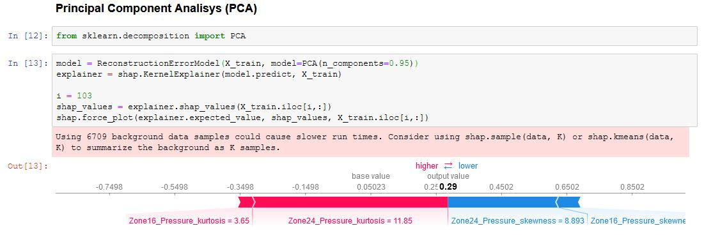
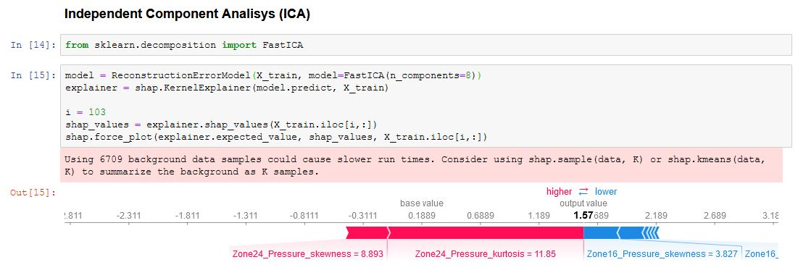

# Explainable-Anomaly-Detection
Shapley Values of Reconstruction Errors for Explaining Anomaly Detection.

Local explanations of which feature tends to have a higher or lower reconstruction error.

### Example PCA

### Example ICA

