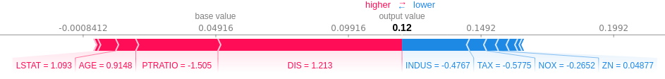
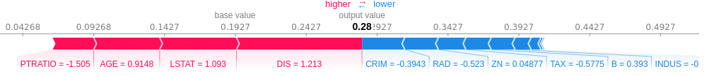

# Explainable-Anomaly-Detection
Shapley Values of Reconstruction Errors for Explaining Anomaly Detection.

Local explanations of which feature tends to have a higher or lower reconstruction error.

### Example with PCA

```python
import pandas as pd
from sklearn.preprocessing import StandardScaler
from sklearn.decomposition import PCA
from models.model import ReconstructionErrorModel
import shap

# load JS for visualization
shap.initjs()

# load boston dataset
X, y = shap.datasets.boston()

# standarize the data
cols = X.columns.values
X = pd.DataFrame(StandardScaler().fit_transform(X), columns=cols)

# generate explanation
model = model = ReconstructionErrorModel(X, model=PCA(n_components=0.95))
explainer = shap.KernelExplainer(model.predict, X)

i = 10
shap_values = explainer.shap_values(X.iloc[i,:])
shap.force_plot(explainer.expected_value, shap_values, X.iloc[i,:])
```




### Example with ICA

```python
import pandas as pd
from sklearn.preprocessing import StandardScaler
from sklearn.decomposition import FastICA
from models.model import ReconstructionErrorModel
import shap

# load JS for visualization
shap.initjs()

# load boston dataset
X, y = shap.datasets.boston()

# standarize the data
cols = X.columns.values
X = pd.DataFrame(StandardScaler().fit_transform(X), columns=cols)

# generate explanation
model = model = ReconstructionErrorModel(X, model=FastICA(n_components=5))
explainer = shap.KernelExplainer(model.predict, X)

i = 10
shap_values = explainer.shap_values(X.iloc[i,:])
shap.force_plot(explainer.expected_value, shap_values, X.iloc[i,:])
```


